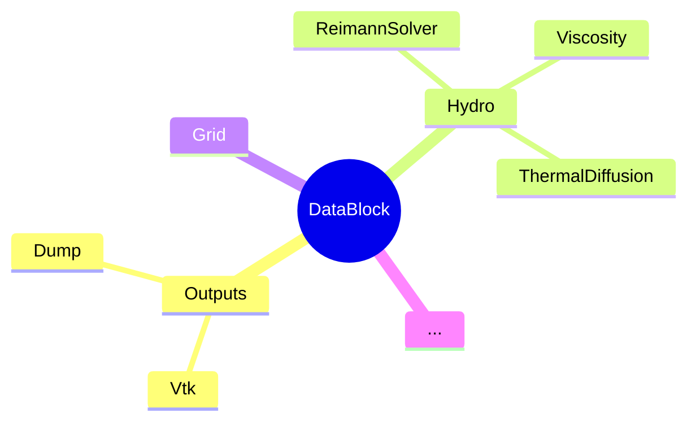

# Programming in Idefix: Data structures

<!-- toc -->

- [Scope](#scope)
- [CPU VS GPU: essentials](#cpu-vs-gpu-essentials)
- [Device / Host dichotomy](#device--host-dichotomy)
- [Arrays: `IdefixArrayND`](#arrays-idefixarraynd)
- [Loops and kernels: `idefix_for`](#loops-and-kernels-idefix_for)
  * [Important notes on kernel GPU portability](#important-notes-on-kernel-gpu-portability)
- [DataBlocks](#datablocks)

<!-- tocstop -->

## Scope

In this session we will cover the fundamental structures provided by `idefix.hpp`
and explain how data is organized and handled.
We will cover `IdefixArrayND<T>`, `idefix_for` and `DataBlock`.

As a preamble, we'll start by reviewing the fundamental differences between
CPU and GPU.

## CPU VS GPU: essentials

- CPUs execute instructions sequentially -> loops are sequential
- GPUs run *the same instruction* many times at once -> *kernels* are
  vectorized (where "many" = 10^3, typically)

CPUs are much more versatile, but GPUs are much faster for the few tasks they are able
to perform, and luckily, applying the same operation to many elements in an array is
exactly what they excel at !

> **Pop quizz !**
>
> choose your weapon

<details> <summary> CPU </summary>

</details>

<details> <summary> GPU </summary>

</details>

To keep the code *portable*, we'll need to write our *kernels* in a way that can be
compiled as sequential loops when targeting CPUs. We'll see how to achieve this with
`idefix_for`.


## Device / Host dichotomy

So GPUs are very efficient and fast *at certain tasks*, but there are
still a variety of things our program needs to do that are better left to CPUs, like
input/output (IO), calling functions... As we'll see, writing GPU-capable code also
adds complexity.

In order to achieve maximal performance *and* minimal complexity, we divide the code
we write in two parts:
- intensive loops are written as `idefix_for`
- the overarching execution flow, as well as certain operations (like IO), are still
  written as mainline C++.

We call *host* the physical part of the machine that runs the execution flow (always a
CPU), and we call *device* the part that executes intensive loops (which may be a GPU
*or* a CPU).

It is important to understand that host memory and device memory are separate spaces:
data that exists in *host space* cannot directly be accessed from *device space*, and
vice-versa.


## Arrays: `IdefixArrayND<T>`

Idefix arrays (aliases for `Kokkos::View`) are idefix's base container types. They
represent data **in device space**.

They come in 4 different dimensionalities
- `IdefixArray1D<T>`
- `IdefixArray2D<T>`
- `IdefixArray3D<T>`
- `IdefixArray4D<T>`

Where `T` is a placeholder typename for the contained data type (Idefix arrays are `C++`
*class templates*).

Note that `idefix.hpp`, which is included everywhere throughout idefix's code base,
defines a `real` type alias, which can represent `double` or `float` (single precision),
and is known at compile-time. In practice most arrays are `IdefixArrayND<real>`.

Let's see how a 3D array of `double` is declared. First, in pure `C`
```cpp
const Nx = 16;
const Ny = 16;
const Nz = 16;
double[Nz, Ny, Nx] arr;
```

The equivalent `IdefixArray` would be
```cpp
#include "idefix.hpp"

const Nx = 16;
const Ny = 16;
const Nz = 16;
IdefixArray3D<real> arr(
    "my array", // array label
    Nz, Ny, Nx // array dimensions
);
```

> Note 1
>
> Arrays have *labels* (here, "my array")
> which are important when debugging (they are used in tracebacks), so make sure to
> make them *unique*.

> Note 2
>
> While C-arrays are not initialized on allocation, IdefixArrays are filled with 0 on
> allocation (unless specified otherwise)

> Note 3
>
> `IdefixHostArrayND<T>` are host-space arrays, they are used to *mirror* data in device
> space. Host<->Device synchronisation is only performed when needed.

## Loops and kernels: `idefix_for`

`idefix_for` is an abstraction that can be compiled to GPU kernels *or* as simple `for`
loops, depending on the target architecture.

As an example, let's see how we would fill a 100-element 1D array with `1.0`.

First, in simple `C++`:
```cpp
const int N = 256;
double[N] data;
for(int i=0, i<N; i++) {
  data[i] = 1.0;
}
```

Now using `idefix_for`:
```cpp
#include "idefix.hpp"

const int N = 256;
IdefixArray1D<real> arr(
  "my array", // array label
  N // array dimensions
);
idefix_for(
  "fill arr", // kernel label
  0, N, // kernel bounds (0 <= i < N)
  KOKKOS_LAMBDA(int i) {
    arr(i) = 1.0;
  }
);
```

> Just like arrays, kernels have labels, which are equally important for debugging.

> Note that C-array elements are accessed with `[]` while `IdefixArray` elements
> are accessed with `()`

> Memory allocation is very expensive. Most of the time you'll be processing
> `IdefixArray`s that are *already* allocated. If you need additional arrays, avoid
> reallocating them on each cycle: reuse allocated memory as often as possible.

How about a 2D version of this ?
```cpp
#include "idefix.hpp"

const int Nx = 16;
const int Ny = 16;

IdefixArray2D<real> arr(
  "my array", // array label
  Ny, Nx // array dimensions
);
idefix_for(
  "fill arr", // kernel label
  0, Ny, // kernel j bounds (0 <= j < Ny)
  0, Nx, // kernel i bounds (0 <= i < Nx)
  KOKKOS_LAMBDA(int j, int i) {
    arr(j, i) = 1.0;
  }
);
```

> important: in `ND` (`N`>1), the contiguous index is the last one (here `i`)
> IdefixArrays use *C-like* layout.

Generalizing to 3 and 4D is left as an exercise to the reader.


### Important notes on kernel GPU portability

- pointers (in particular, `this->`) cannot be captured in a kernel (although it builds
  fine on CPU targets !)
- `if/else` (branching) is computationally **very** expensive on GPU
- Kernels are executed in the order they are submitted, **but** the host doesn't stop to
  wait for the device. This is important when managing `MPI` exchanges (the host is
  happy trade data in buffers that the device isn't done writing !).


## DataBlocks

In `idefix`, the global state of the program is encapsulated in classes.

`DataBlock` is central to class interactions: it knows about every components of the
global state, and all of them know it too !

Here's a simplified graph representing these connections.



This means that you can access every parts of the global state by going through your
local `DataBlock`.

```cpp
void UserdefBoundary(Hydro *hydro, int dir, BoundarySide side, real t) {
  DataBlock *data = hydro->data;
  IdefixArray1D<real> x1 = data->x[IDIR]; // shallow copy !
  IdefixArray1D<real> x3 = data->x[KDIR]; // shallow copy !
  idefix_for(
    //my very smart code here
  );
}
```

Note that we create shallow copies of every `IdefixArray` we'll need in our
`idefix_for`, but no data is actually being copied (so it's actually very cheap). This
is important for GPU compatibility.


> When running idefix with domain decomposition (MPI) each process gets its own
> DataBlock, so the attached grid represents the current process' subdomain only.

> `DataBlockHost` is the host-side mirror of `DataBlock`.
> In the following sessions you'll see how to make them talk to each other to send data
> from host to device space (and vice versa).
