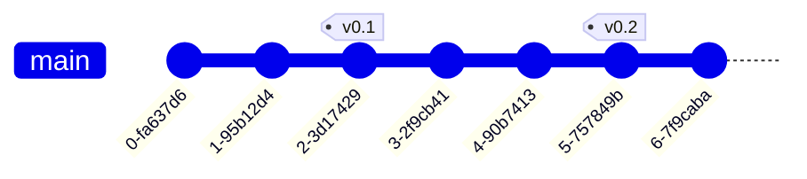
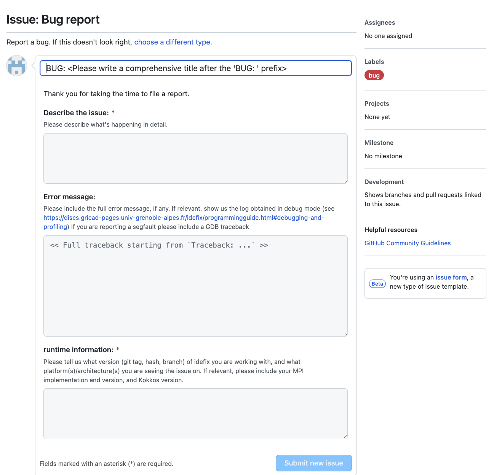
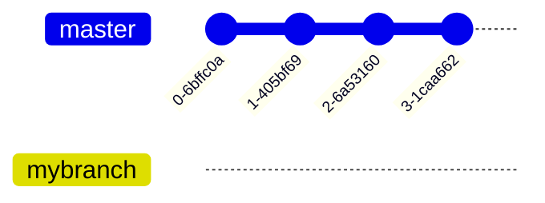
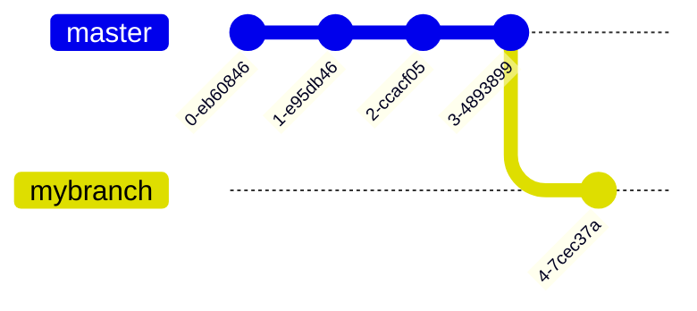

# Git for Idefix

<!-- toc -->

- [General introduction](#general-introduction)
  * [Scope](#scope)
  * [What is `git` ?](#what-is-git-)
  * [When do you need it ?](#when-do-you-need-it-)
  * [git command line interface (CLI)](#git-command-line-interface-cli)
- [Hands-on tutorial to the `git` command line](#hands-on-tutorial-to-the-git-command-line)
  * [Requirements](#requirements)
  * [Additional recommendations](#additional-recommendations)
  * [Getting started (first commits)](#getting-started-first-commits)
    + [Modifying files that are already tracked](#modifying-files-that-are-already-tracked)
  * [Going back in time](#going-back-in-time)
  * [Using a remote reference](#using-a-remote-reference)
    + [Definitions](#definitions)
    + [Setting up your project on GitHub](#setting-up-your-project-on-github)
  * [Using branches](#using-branches)
    + [Introdution to branches](#introdution-to-branches)
    + [Creating a new branch](#creating-a-new-branch)
    + [Merging back](#merging-back)
- [Practical development](#practical-development)
  * [Pre-requisites](#pre-requisites)
  * [GitHub Issues](#github-issues)
    + [Before you report](#before-you-report)
    + [Bug report good practices](#bug-report-good-practices)
  * [Contributing a patch](#contributing-a-patch)
    + [Fork it](#fork-it)
    + [Clone it](#clone-it)
    + [Branch it](#branch-it)
    + [Patch it](#patch-it)
    + [Push it](#push-it)
    + [Open a Pull Request](#open-a-pull-request)
  * [automated validation (continuous integration)](#automated-validation-continuous-integration)
    + [lint](#lint)
    + [tests (Continuous Integration (CI))](#tests-continuous-integration-ci)
  * [Reviews](#reviews)

<!-- tocstop -->

# General introduction

## Scope

This document is an introduction the `git` command line, for `idefix`, comprised of two
parts. In the first one we'll cover the fundamentals of version-control and branching
workflows.

- create and setup a git project (`git init`)
- add and remove files (`git add`, `git rm`)
- check-in new changes (`git commit`)
- synchronize your local and remote copies of a project (`git pull`, `git push`)
- navigate the change history (`git log`, `git checkout`)
- working with multiple branches (`git branch`, `git merge`)
- resolve history conflict
- visualize the current state (`git status`, `git diff`, `git branch`)


In the second part, we'll discuss practical aspects of collaborating on GitHub for a
project like `idefix`.

- bug reports (issues)
- contributing patches (pull requests), reviewing
- continuous integration (CI for shorts) (lint and tests)

Mastering `git` goes well beyond the scope of the present document.
In particular,  history rewriting (`git rebase`) and history inspection (`git bisect`)
are considered *advanced*, and will not be covered here. They should not however be
considered *esoteric*, and consistute very powerful tools for the initiated.


## What is `git` ?

[git](https://git-scm.com) is a **distributed version control system** (VCS).

A *version control system* enables *management of change history* for files.
We will see about the "distributed" part later.

Here's a representation of a simple (single branch) change history, where the arrow
indicates time, each dot represents a different *version*. Some versions receive a
meaningful name (called a **tag**), but most don't.


(left is past, right is future)
(We will see more interesting examples later).

Essentially, a VCS enables a workflow where change is *incremental*, *reversible*, and *searchable*.
This drastically decreases the cost of making mistakes and breaking things, because it's easy to go back to a previous version !


## When do you need it ?

`git` is useful for any project you work on today and will still care about tomorow. It could be some source code, but it can also be a **paper manuscript**.
This very document is backed-up with `git`.


## git command line interface (CLI)

There exist **hundreds** Graphical User Interfaces (GUIs) for git, and most IDEs
contain some kind of `git` interface, but the fundamental interface, and the
*only* one that is available on servers typically accessed via `ssh` tunnels, is
the command line, so that's what we will use here.

The `git` CLI is composed of many sub-commands `git <stuff>`. In this tutorial
we will go through the essential ones.

I strongly recommend *sticking* to the CLI after you've mastered the basics,
because it is by far the most portable way to use git: it is the only one
available everywhere.

# Hands-on tutorial to the `git` command line


## Requirements

>    If you've used git on your current machine in the past, skip this section.

make sure `git` is available on your system
```shell
$ which git
```
if not, follow [official docs](https://git-scm.com/book/en/v2/Getting-Started-Installing-Git)

Next, you'll want to configure git globally
```shell
$ git config --global user.name "John Doe"
$ git config --global user.email johndoe@example.com
```

## Additional recommendations

It is also recommended to associate a terminal-based editor of your choice to `git`.
For instance this is how you'd set `nano`
```shell
$ git config --global core.editor nano
```
This is because some advanced sub-commands require an editor, and its preferable
to know that you are comfortable with the one you get (otherwise it may default
to `vi`, which is infamously hard to exit when you've never used it).

It it recommended that to sign up on GitHub.

## Getting started (first commits)

>    In this section we will create a dummy project *from scratch*. You can use an
>    actual project of yours instead if you feel comfortable to.


Create a new project (or *repository* from now on)
```shell
$ mkdir my-project
$ cd my-project
$ git init
```
We now have an empty project: no files are currently being *tracked*, and we
have no history. Let's introduce a very useful command that will help us
visualize the current state of the repository : `git status`.

>    While the output of `git status` calls is included in the page, it is strongly
>    recommended to run these yourself in a terminal.

<details><summary> git status </summary>

```

On branch main

No commits yet

nothing to commit (create/copy files and use "git add" to track)
```

</details>

>    We see that our history tree already contains a default branch named `main`. We
>    explore the concept of branches in a following section.


Now let's start by creating some file
```shell
$ echo "Hello world" > README.txt
```

and see how this affects the state

<details><summary> git status </summary>

```
On branch main

No commits yet

Untracked files:
  (use "git add <file>..." to include in what will be committed)
    README.txt

nothing added to commit but untracked files present (use "git add" to track)
```
</details>

We see that the file we just created is currently *untracked*, meaning its evolution is
not followed by `git`. The output of `git status` also contains a helpful hint at what
to do next to start tracking it:

```
$ git add README.txt
```
<details><summary> git status </summary>

```
On branch main

No commits yet

Changes to be committed:
  (use "git rm --cached <file>..." to unstage)
    new file:   README.txt
```
</details>

We see that `README.txt` is now being *tracked* by the system, but it is not *committed* yet, meaning we haven't created an actual *version* (or *commit*, from now on) in the history. So let's do just that

```
$ git commit -m "Add README.txt"
```

with `-m`, with associate a *message* to our commit.
The message should be *concise* yet *meaningful* and describe the change that was performed.

<details><summary> git status </summary>

```
On branch main
nothing to commit, working tree clean
```
</details>

Hurray ! Now `README.txt` is being tracked by `git` *and* we have a history that should look something like this
(hey, one has to start _somewhere_)


>    `HEAD` represents our current position in the history. It usually points to the latest commit.
>    In the next section we will learn how to *move* it across the history tree.
>
>    (I'm using a "tag" as a visual indication of this position, but it's not to be confused with an actual git tag)

More interestingly, we can now visualize our brand new history with `git log`, which should output something like this
```
commit 956206c5db49848047ef45161ed9e457dcb5f9a8 (HEAD -> main)
Author: John Doe <johndoe@example.com>
Date:   Mon Nov 28 15:22:38 2022 +0100

    Add README.txt
```

There we see all our most recent commits (just one in this case).


>    In addition to the rest of our metadata (author, date, commit message), each commit
>    is uniquely identified by a
>    [hash](https://en.wikipedia.org/wiki/Secure_Hash_Algorithms)
>    (`956206c5db49848047ef45161ed9e457dcb5f9a8` in the example above). This is an
>    alphanumeric string that is generated by a deterministic but chaotic algorithm,
>    whose outputs are *very likely* to be unique within a project.


### Modifying files that are already tracked

Let's modify a file and check how it affect `git status`
```
$ echo "modification" >> README.txt
$ git status
On branch main
Untracked files:
  (use "git add <file>..." to include in what will be committed)
	README.txt

nothing added to commit but untracked files present (use "git add" to track)
```
`README.txt` now contains some *unstaged* modifications, meaning that if we create a new commit right now, these changes will not be included.
It is very useful to visualize the difference between the previous commit and the current (unstage) state of the file using `git diff`
```
$ git diff
diff --git a/README.txt b/README.txt
index 802992c..1d1f35b 100644
--- a/README.txt
+++ b/README.txt
@@ -1 +1,3 @@
 Hello world
+
+modification
(END)
```
Added lines are prepended with `+`. Deleted lines are prepended with `-` (there are none in this case).

Now, in order to commit this update to our file, we need to *stage* it again (this is done with `git add README.txt`), and create
a new commit (`git commit -m "modify README.txt"`).


> Exercise:
>
> Repeat the last few steps: add new files to the index, and commit them.
> Modify existing files and commit the changes.

We should now have a more detailed history, with a couple commits all on one branch.


## Going back in time

In this section we will learn how to *navigate* the history, i.e., visiting previous versions of the project using `git checkout`.

`git checkout` is the go-to command to **change the position of `HEAD` on the history tree**.


Say we want to visualize our project as it was two commits ago. What we want is to displace `HEAD` as


This can be done as a *relative* displacement

```
$ git checkout HEAD~2
```

Alternatively, if we know the hash of the exact commit we want to visit, we can use *absolute* displacement. For instance
```
$ git checkout 956206c5db49848047ef45161ed9e457dcb5f9a8
```


>    While visiting a commit that belongs to the past, we **cannot** commit new changes (time paradoxes are not allowed !)


To get back to our initial state (visit the *present*) of our `main` branch
```
$ git checkout main
```

To get back to the *previous* position in history, a convenience, akin to `cd -` is
```
$ git checkout -
```

## Using a remote reference

In this section we learn how to synchronise a local copy with a remote one using `git pull` and `git push`.


### Definitions

So far, we've covered the *version control* in *distributed version control system*, but we have yet to see what "distributed" means.

Up to this point, we've only used `git` on a single machine, which is not very useful when it comes to working in collaborations,
or simply backing up your work.

`git` in fact allows you to synchronize the state of your project between many machines.
In most cases, one machine (usually a server) will be considered the reference for all other ones.
GitHub is one of many different platforms that offer free hosting for your git projects, but bare in mind that
- GitHub is not git
- there are alternatives (Gitlab, Bitbucket, ...)
- *any* server may be used to host a git project if needed (including machines owned by your employer)

For the sake of simplicity, I will assume GitHub is our chosen remote host in the following paragraph.

### Setting up your project on GitHub

Let's create an empty repository on GitHub
https://github.com/new

The newly created project should now be available at `https://github.com/<your username>/<name of the project>`
Follow instructions there ("push an existing repository from the command line").

Notice that the final command needed to sync your branch history from local to remote was some variation of `git push`.

Go to `https://github.com/<your username>/<name of the project>/network` to visualize your history as it now exists on the remote.

> Exercise:
>
>    Add a few more commits locally, then visualize the history tree locally *and* remotely. Notice they are now out-of-sync.
>    Synchronize them back using `git push`

It should be clear that as long as only one person contributes to the project from a single machine, the host history will always be behind the local one.

However, pushing directly to the reference branch (`main` here, sometimes `master`) on a shared reference will work when working with colleagues and/or multiple machines, because histories could very easily diverge and clash.
In order to avoid this situation, we can forbid that anyone pushes changes directly to the `main` branch.
With this new rule, your local copy of the `main` branch will in general be behind the remote copy (some commits will exists on the remote that do not exist on your local copy). We can schematize this situation as follow

Our local copy (clone) has the following history

while the remote has


In order to sync up histories *from the remote to your local copy*, we'll use `git pull`
```
$ git pull
```

as a result of which, we'll find ourselves with the following local history


So _how_ are your supposed to add commits to the main branch since we just forbidded anyone to push *directly* there ?
The solution to this problem is to use multiple branches, as we will see in the next section.


## Using branches

>    In this section we will learn how to use history *branches*,
>    which are a central and powerful concept at the heart of most development workflows.

### Introdution to branches
A branch can be thought of as an *alternative timeline* in which changes can be made without impacting the state of the `main` history.

A branch may be used to develop a change (say a feature in your code, a section in your paper...), **in isolation**.
Here's what a two-branch history may look like


Notice that commits have been made to both branches since their last common ancestor commit.
Indeed, branches allow you to work on multiple aspects of your projects in parallel.
This is also what enables *collaborating* on a project with other persons.

It is best to keep each branch dedicated to a very specific task to avoid overlaps (conflicts).


Again, `HEAD` indicates our current position on the history tree. It can only point to one branch at a time.
Visualizing the current branch on the command line is done like so
```
$ git branch
* main
feature
```
where the `*` char indicates the current position of `HEAD`.

As you may have guessed, the natural way to *switch branch* is to use `git checkout`

```
$ git checkout feature
```


### Creating a new branch
To create a new branch, and position `HEAD` onto it
```
$ git branch feature_2
$ git checkout feature_2
```
Alternatively, this can be accomplished in one command with
```
$ git checkout -b feature_2
```
where `-b` means (you guessed it) "branch".

### Merging back
Reconcilling parallel histories is called *merging*.


This operation can in principle be accomplished on the command line as follow
```shell
$ git checkout main
$ git pull
$ git merge --no-ff feature
```

However, in collaborations, we need to avoid divergences to the reference copy. Because
of that, we need to ensure that mergers only happen on the reference copy of the
repository (in our example, on GitHub). We'll use *Pull Requests* for that, as we'll see
in the following part.


# Practical development

This section covers **technicalities** of collaboration and attempts to summarize
important aspects of efficient communication around a code project. However please keep
in mind that `idefix`, as all things, is developed for **people** by **people**. This
means that developers (and yourself) may have (diverging ?) **opinions**, so being
[**technically** correct](https://knowyourmeme.com/photos/909991-futurama) may not
always be sufficient to push an idea forward.

This is a whole other topic but in brief: please be nice to each other.

[(nice: humble, patient, sympathetic, actively encouraging, inclusive,
respectful)](https://www.youtube.com/watch?v=n5QaOADqSyY&t=2s)

## Pre-requisites

In the following, I'll assume you have signed up to GitHub and are able to login.
I also recommend [setting up your account for ssh](https://docs.github.com/en/authentication/connecting-to-github-with-ssh/generating-a-new-ssh-key-and-adding-it-to-the-ssh-agent)
(this will save you the trouble
of entering your password every time you interact with GitHub).

## GitHub Issues

GitHub includes an *issue tracker*. *Issues* are development related discussion
threads that are:
- public
- searchable
- lasting

making them much better than private Slack conversations (but of course this never happened).

Most of the time, they are used to report *bugs*. I'll include the first line from
[the wiki page](https://en.wikipedia.org/wiki/Software_bug)

> A software bug is an error, flaw or fault in the design, development, or operation of computer software that causes it to produce an incorrect or unexpected result, or to behave in unintended ways.

Note that this includes *but isn't limited to* runtime crashes !

Issues themselves are not limited to bug reports. They can also be used to propose and
discuss new features or ask questions !


[Creating an issue](https://docs.github.com/en/issues/tracking-your-work-with-issues/creating-an-issue)

### Before you report

- search the issue tracker: has your problem been reported yet ?
- try updating idefix and see if the problem persists.


### Bug report good practices


When reporting a bug, it's important to be explicit and comprehensive.

> A bug is like a crime scene: every detail is potentially a decisive clue.

Your readers are much more likely to provide adequate help if they are able to
*reproduce* the problem you're having.

Be sure to include as much relevant details as possible. For instance
- what version (tag, branch, or hash) of idefix are you working with ?
- what implementation of MPI (and which version) ?
- if you updated the Kokkos submodule, what version are you at ? (also please tell us why)
- what machine/architecture are you working on ?
- include the exact (and complete !) error message (maybe even a full log)
- ...

In short, **provide the detective (reader) with as many clues as you can**. When in
doubt, prefer sharing too much than too little.

## Contributing a patch

> A *patch* may be a *(bug)fix* or a new *feature*.

We'll review the steps towards contributing a patch. Following the whole procedure can
be a little overwhelming, but note that most of the steps are only needed the first time
you do it, so it's much simpler the second time. The process is also identical for many
open source projects !

### Fork it
Because you don't have commit-rights on the `idefix-code` repository, you'll need to
*fork* it. This means creating a copy that *belongs to you*, which will allow you to
create branches !


⚠️⚠️⚠️
Untick the following box
⚠️⚠️⚠️


### Clone it
*clone your fork* (i.e. create a local copy of your remote fork)
(see the "code" button)


```shell
$ git clone git@github.com:<USER>/idefix.git -b v2.0
```

### Branch it

```shell
$ cd idefix
$ git branch mybranch
$ git checkout mybranch
```



### Patch it

Edit the code with your favourite code editor, then commit changes to your branch
```
$ git add -u
$ git commit -m "description of the change"
```



### Push it

```
$ git push
```

oops, that didn't work... But the error message tells us exactly what's needed !
```shell
$ git push --set-upstream origin mybranch
```

### Open a Pull Request

Return to [https://github.com/idefix-code/idefix](https://github.com/idefix-code/idefix)


- select the target branch (`master` by default)
- explain what your patch does / what problem it solves (is it a new feature, a bugfix ?)
- if it resolves an known issue, include "close #(issue number)" in the message


## automated validation (continuous integration)

Your patch needs to be validated (in short, checked for regressions). This process
is performed automatically when you open a pull request and when you push new commits to
a branch associated with a pull request.

### lint

> *linting* is the process of statically checking the code for common stylistic mistakes
> and known pitfalls.

We use `pre-commit` to lint idefix. You can replicate this process locally by
[installing pre-commit](https://pre-commit.com/#install), then running

```
$ pre-commit run --all-files
```

It is also recommended to use `pre-commit` continuously so it runs every time you invoke
`git commit ...`. This is achieved by running `pre-commmit install` (once).

It can be frustrating at times that pre-commit may prevent you from saving your work, so
know that you can disable it for a quick-and-dirty commit as
```
$ git commit ... --no-verify
```


### tests (Continuous Integration (CI))

This is the most important part of automated validation. Setups in `test/` are built
against your revision, run on GPU (some of them in parallel), and outputs are validated,
by means of comparison with analytical solution and/or with previous "known good"
results.

This process ensures that code changes do not break existing functionality (this is
what's called a *regression*). Regressions are extremely common during development,
do not be alarmed ! When you have several, just pick the first one, run the test locally,
iterate on your patch until the test passes without error, commit, and push again !
Rince and repeat until all regressions are gone !

In idefix v2.0 (in prep), it is possible to run test setup locally with a simple call:
```shell
$ cd $IDEFIX_DIR/test/path/to/my/test
$ python testme.py
```

> Note 1
>
> On some machines, the `python` command uses Python 2, but we need Python 3
> In such an environment, the command `python3` may be used instead.

> Note 2
>
> running idefix's tests requires a couple Python modules that may not be installed
> depending on your exact environment. All requirements can be installed in one go with
> ```shell
> $ python -m pip install -r $IDEFIX_DIR/test/python_requirements.txt
> ```

In most cases, it is recommended (and it may be requested during review) to add a new
test along with your patch, so we can validate that your code keeps working in the
future.


## Reviews

This is when human interaction comes in again !
Maintainers (Geoff) will have a look at your code and may ask questions and/or request
changes.

This process may be iterative. Please be patient about it and understand that
maintainers (not just idefix's) are usually busy and may be take a couple days to
respond.

When your patch is ready (tested and approved), it will be merged !
