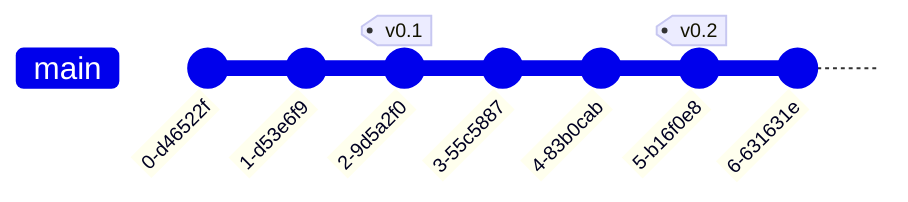
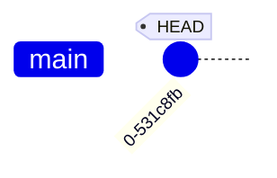

# git-tutorial
intro to git as a static markdown page


## Scope
This is a simple introduction to `git`.
In this document, you will learn the fundamentals of version-control, and we'll cover the following skills

- create and setup a git project (`git init`)
- add and remove files (`git add`, `git rm`)
- check-in new changes (`git commit`)
- synchronize your local and remote copies of a project (`git pull`, `git push`)
- navigate the change history (`git log`, `git checkout`)
- working with multiple branches (`git branch`, `git merge`)
- resolve history conflict
- visualize the current state (`git status`, `git diff`, `git branch`)

Of course, mastering `git` goes well beyond the scope of the present document.
In particular, the following topics will *not* be covered, but are no less important:

- collaboration (sharing a project with other persons)
- editing the history (`git rebase`)
- bisecting the history to look for bugs (`git bisect`)


## Additional resources
[Interactive git sandbox](https://git-school.github.io/visualizing-git/)


# Introduction

## What is `git` ?

[git](https://git-scm.com) is a **distributed version control system** (VCS).

A *version control system* enables *management of change history* for files.
We will see about the "distributed" part later.

Here's a representation of a simple (single branch) change history, where the arrow indicates time, each dot represents a different *version*



(We will see more interesting examples later).

Essentially, a VCS enables a workflow where change is *incremental*, *reversible*, and *searchable*.
This drastically decreases the cost of making mistakes and breaking things, because it's easy to go back to a previous version !


## When do you need it ?

`git` is useful for any project you work on today and will still care about tommorow. It could be some source code, but it can also be a **paper manuscript**.
This website itself is backed-up with `git`.


## git command line interface (CLI)

There exist *many* GUIs (Graphical User Interfaces) for git, and most IDEs
contain some kind of `git` interface, but the fundamental interface, and the
*only* one that is available on servers typically accessed via `ssh` tunnels, is
the command line, so that's what we will use here.

The `git` CLI is composed of many sub-commands `git <stuff>`. In this tutorial
we will go through the essential ones.

I strongly recommend *sticking* to the CLI after you've mastered the basics,
because it is by far the most portable way to use git: it is the only one
available everywhere.

# Hands-on tutorial


## Requirements

>    If you've used git on your current machine in the past, skip this section.

make sure `git` is available on your system
```
$ which git
```
if not, follow [official docs](https://git-scm.com/book/en/v2/Getting-Started-Installing-Git)

Next, you'll want to configure git globally
```
$ git config --global user.name "John Doe"
$ git config --global user.email johndoe@example.com
```

## Additional recommendations

It also recommended to associate a terminal-based editor of your choice to `git`.
For instance this is how you'd set `nano`
```
$ git config --global core.editor nano
```
This is because some advanced sub-commands require an editor, and its preferable
to know that you are confortable with the one you get (otherwise it may default
to `vi`, which is infamously hard to exit when you've never used it).

It it recommended that to sign up on GitHub.

## Getting started (first commits)

>    In this section we will create a dummy project *from scratch*. You can use an
>    actual project of yours instead if you feel confortable to.


Create a new project (or *repository* from now on)
```
$ mkdir my-project
$ cd my-project
$ git init
```
We now have an empty project: no files are currently being *tracked*, and we
have no history. Let's introduce a very useful command that will help us
visualize the current state of the repository : `git status`.

>    While the output of `git status` calls is included in the page, it is strongly
>    recommended to run these yourself in a terminal.

<details><summary> git status </summary>

```

On branch main

No commits yet

nothing to commit (create/copy files and use "git add" to track)
```

</details>

>    We see that our history tree already contains a default branch named `main`. We explore the concept
>    of branches in a following section.


Now let's start by creating some file
```
$ echo "Hello world" > README.txt
```

and see how this affects the state

<details><summary> git status </summary>

```
On branch main

No commits yet

Untracked files:
  (use "git add <file>..." to include in what will be committed)
    README.txt

nothing added to commit but untracked files present (use "git add" to track)
```
</details>

We see that the file we just created is currently *untracked*, meaning its evolution is not followed by `git`.
The output of `git status` also contains a helpful hint at what to do next to start tracking it:

```
$ git add README.txt
```
<details><summary> git status </summary>

```
On branch main

No commits yet

Changes to be committed:
  (use "git rm --cached <file>..." to unstage)
    new file:   README.txt
```
</details>

We see that `README.txt` is now being *tracked* by the system, but it is not *commited* yet, meaning we haven't created an actual *version* (or *commit*, from now on) in the history. So let's do just that

```
$ git commit -m "Add README.txt"
```

with `-m`, with associate a *message* to our commit.
The message should be *concise* yet *meaningful* and describe the change that was performed.

<details><summary> git status </summary>

```
On branch main
nothing to commit, working tree clean
```
</details>

Hurray ! Now `README.txt` is being tracked by `git` *and* we have a history that should look something like this
(hey, one has to start _somewhere_)




>    `HEAD` represents our current position in the history. It usually points to the latest commit.
>    In the next section we will learn how to *move* it across the history tree.
>
>    (I'm using a "tag" as a visual indication of this position, but it's not to be confused with an actual git tag)

More interestingly, we can now visualize our brand new history with `git log`, which should output something like this
```
commit 956206c5db49848047ef45161ed9e457dcb5f9a8 (HEAD -> main)
Author: John Doe <johndoe@example.com>
Date:   Mon Nov 28 15:22:38 2022 +0100

    Add README.txt
```

There we see all our most recent commits (just one in this case).


>    In addition to the rest of our metadata (author, date, commit message), each commit is uniquely identified by a [hash](https://en.wikipedia.org/wiki/Secure_Hash_Algorithms)
>    (`956206c5db49848047ef45161ed9e457dcb5f9a8` in the example above). This is an alpha-numeric string
>    that is generated by a deterministic but chaotic algorithm, which outputs are *very likely* to be unique
>    within a project.


### Modifying files that are already tracked

Let's mofify a file and check how it affect `git status`
```
$ echo "mofification" >> README.txt
$ git status
On branch main
Untracked files:
  (use "git add <file>..." to include in what will be committed)
	README.txt

nothing added to commit but untracked files present (use "git add" to track)
```
`README.txt` now contains some *unstaged* modifications, meaning that if we create a new commit right now, these changes will not be included.
It is very useful to visualize the difference between the previous commit and the current (unstage) state of the file using `git diff`
```
$ git diff
diff --git a/README.txt b/README.txt
index 802992c..1d1f35b 100644
--- a/README.txt
+++ b/README.txt
@@ -1 +1,3 @@
 Hello world
+
+modification
(END)
```
Added lines are prepended with `+`. Deleted lines are prepended with `-` (there are none in this case).

Now, in order to commit this update to our file, we need to *stage* it again (this is done with `git add README.txt`), and create
a new commit (`git commit -m "modify README.txt"`).


> Exercise:
>
> Repeat the last few steps: add new files to the index, and commit them.
> Modify existing files and commit the changes.

We should now have a more detailed history, with a couple commits all on one branch.


## Going back in time

In this section we will learn how to *navigate* the history, i.e., visiting previous versions of the project using `git checkout`.

`git checkout` is the go-to command to **change the position of `HEAD` on the history tree**.


Say we want to visualize our project as it was two commits ago. What we want is to displace `HEAD` as


This can be done as a *relative* displacement

```
$ git checkout HEAD~2
```

Alternatively, if we know the hash of the exact commit we want to visit, we can use *absolute* displacement. For instance
```
$ git checkout 956206c5db49848047ef45161ed9e457dcb5f9a8
```


>    While visiting a commit that belongs to the past, we **cannot** commit new changes (time paradoxes are not allowed !)


To get back to our initial state (visit the *present*) of our `main` branch
```
$ git chekcout main
```

To get back to the *previous* position in history, a convenience, akin to `cd -` is
```
$ git checkout -
```

## Using a remote reference

In this section we learn how to synchronise a local copy with a remote one using `git pull` and `git push`.


### Definitions

So far, we've covered the *version control* in *distributed version control system*, but we have yet to see what "distributed" means.

Up to this point, we've only used `git` on a single machine, which is not very useful when it comes to working in collaborations,
or simply backing up your work.

`git` in fact allows you to synchronize the state of your project between many machines.
In most cases, one machine (usually a server) will be considered the reference for all other ones.
GitHub is one of many different platforms that offer free hosting for your git projects, but bare in mind that
- GitHub is not git
- there are alternative (Gitlab, Bitbucket, ...)
- *any* server may be used to host a git project if needed (including machines owned by your employer)

For the sake of simplicity, I will assume GitHub is our chosen remote host in the following paragraph.

### Setting up your project on GitHub

Let's create an empty repository on GitHub
https://github.com/new

The newly created project should now be available at `https://github.com/<your username>/<name of the project>`
Follow instructions there ("push an existing repository from the command line").

Notice that the final command needed to sync your branch history from local to remote was some variation of `git push`.

Go to `https://github.com/<your username>/<name of the project>/network` to visualize your history as it now exists on the remote.

> Exercise:
>
>    Add a few more commits locally, then visualize the history tree locally *and* remotely. Notice they are now out-of-sync.
>    Synchronize them back using `git push`

It should be clear that as long as only one person contributes to the project from a single machine, the host history will always be behind the local one.

However, pushing directly to the reference branch (`main` here, sometimes `master`) on a shared reference will work when working with colleagues and/or multiple machines, because histories could very easily diverge and clash.
In order to avoid this situation, we can forbid that anyone pushes changes directly to the `main` branch.
With this new rule, your local copy of the `main` branch will in general be behind the remote copy (some commits will exists on the remote that do not exist on your local copy). We can schematize this situtation as follow

Our local copy (clone) has the following history

while the remote has


In order to sync up histories *from the remote to your local copy*, we'll use `git pull`
```
$ git pull
```

as a result of which, we'll find ourselves with the following local history


So _how_ are your supposed to add commits to the main branch since we just forbidded anyone to push *directly* there ?
The solution to this problem is to use multiple branches, as we will see in the next section.


## Using branches

>    In this section we will learn how to use history *branches*,
>    which are a central and powerful concept at the heart of most development workflows.

### Introdution to branches
A branch can be thought of as an *alternative timeline* in which changes can be made without impacting the state of the `main` history.

A branch may be used to develop a change (say a feature in your code, a section in your paper...), **in isolation**.
Here's what a two-branch history may look like


Notice that commits have been made to both branches since their last common ancestor commit.
Indeed, branches allow you to work on multiple aspects of your projects in parallel.
This is also what enables *collaborating* on a project with other persons.

It is best to keep each branch dedicated to a very specific task to avoid overlaps (conflicts).


Again, `HEAD` indicates our current position on the history tree. It can only point to one branch at a time.
Visualizing the current branch on the command line is done like so
```
$ git branch
* main
feature
```
where the `*` char indicates the current position of `HEAD`.

As you may have guessed, the natural way to *switch branch* is to use `git checkout`

```
$ git checkout feature
```


### Creating a new branch
To create a new branch, and position `HEAD` onto it
```
$ git branch feature_2
$ git checkout feature_2
```
Alternatively, this can be accomplished in one command with
```
$ git checkout -b feature_2
```
where `-b` means (you guessed it) "branch".

### Merging back
Reconcilling parallel histories is called *merging*.

```
$ git checkout main
$ git pull
$ git merge --no-ff feature
```
